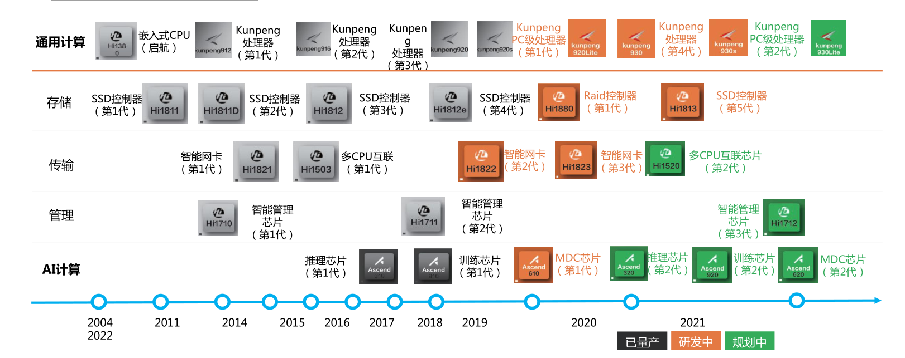
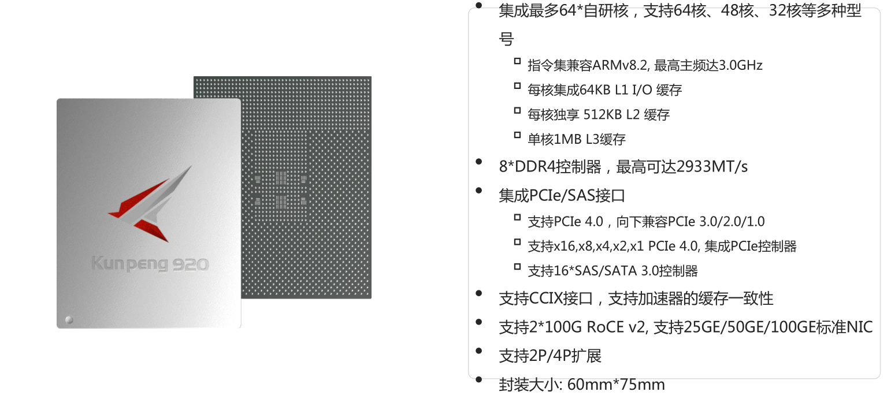
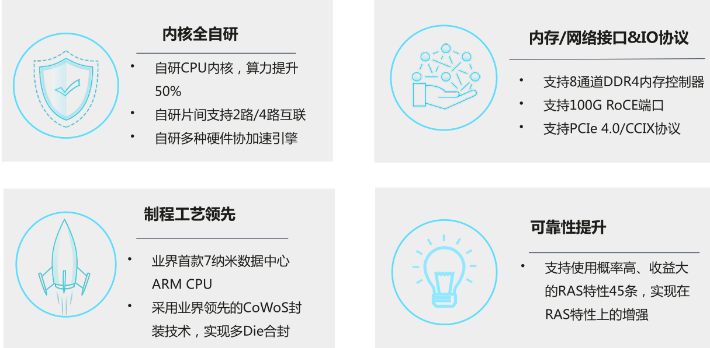
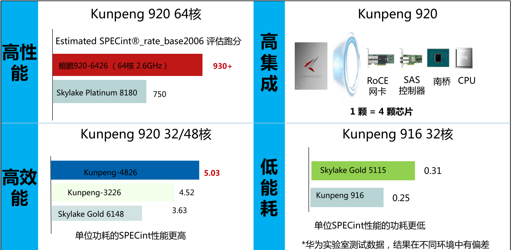
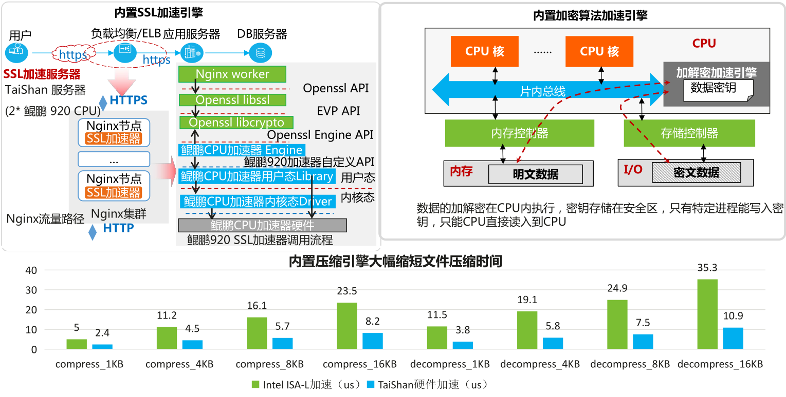
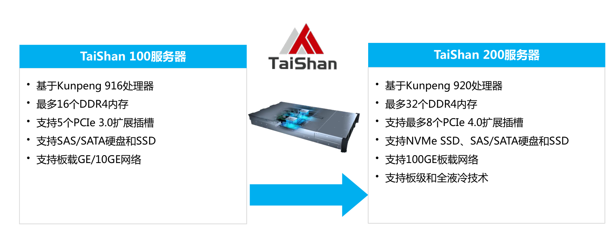
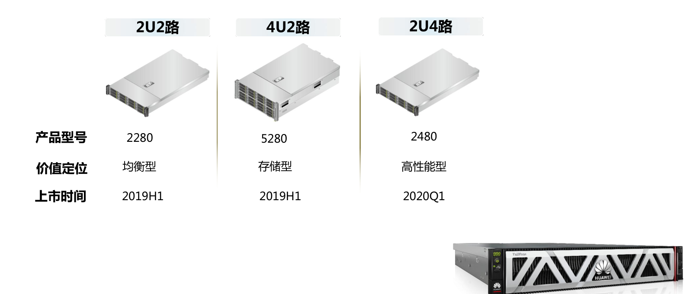
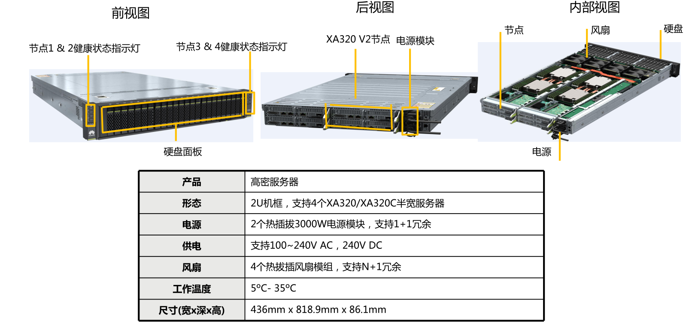
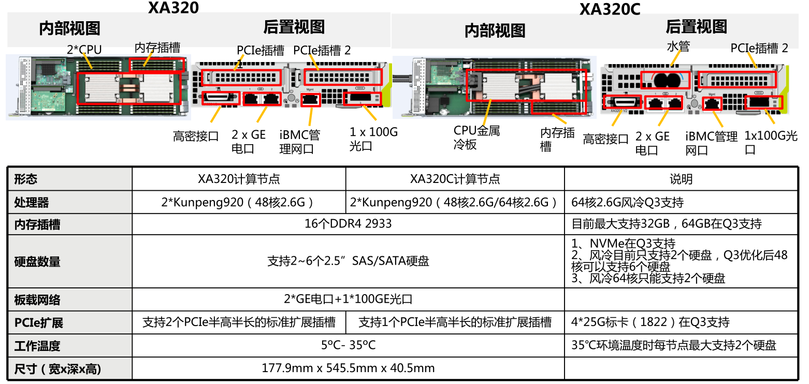

---

---

# 鲲鹏计算资料总结:zap:
[toc]

## 1. 鲲鹏云服务

### 鲲鹏处理器与服务器

#### 鲲鹏处理器

华为鲲鹏处理器是华为自主研发的基于ARM架构的企业级系列处理器产品，包含“算、存、传、管、智”五个产品系统体系。

##### 架构介绍：

华为鲲鹏处理器基于ARM架构。ARM是一种CPU架构，有别于Intel、AMD CPU采用的CISC复杂指令集，ARM CPU采用RISC精简指令集（reduced instruction set computer，精简指令集计算机）。

处理器对比：

##### 优点：

* 采用ARM架构，同样功能性能占用的芯片面积小、功耗低、集成度更高，更多的硬件CPU核具备更好的并发性能。
* 支持16位、32位、64位多种指令集，能很好的兼容从IOT、终端到云端的各类应用场景。
* 大量使用寄存器，大多数数据操作都在寄存器中完成，指令执行速度更快。
* 采用RISC指令集，指令长度固定，寻址方式灵活简单，执行效率高。

##### 规格发展

##### 华为鲲鹏920处理器规格

##### 技术创新

##### 内置多种加速引擎

### Taishan服务器

##### 系列

##### TaiShan 200机架服务器全景图

##### TaiShan 200高密服务器

### 云服务

#### 云计算

美国国家标准与技术研究院（NIST）定义：

云计算是一种模型，它可以实现随时随地，便捷地，随需应变地从可配置计算资源共享池中获取所需的资源（例如，网络、服务器、存储、应用、及服务），资源能够快速供应并释放，使管理资源的工作量和与服务提供商的交互减小到最低限度。

云计算的特点:

1. 快捷的网络访问
2. 自服务和**随需分配**
3. 资源池
4. 灵活有**弹性**
5. 服务可度量


云计算的本质就是自动化和规模化在IT行业的服务化体现！


#### 云服务实例

而云服务正是由于云计算的发展而孕育而生,主要依靠云计算的虚拟化技术.将所有的硬件资源进行计算虚拟化和存储虚拟化,最后得到我们的云服务.

一个简单的网站例子可以是下面这张图:

#### 计算类云服务

计算类云服务有如下这么多种:

##### ECS-(弹性云主机)

弹性云服务器（ Elastic Cloud Server ）是一种可随时自助获取、可弹性伸缩的云服务器，帮助用户打造可靠、安全、灵活、高效的应用环境，确保服务持久稳定运行，提升运营效率。


需要注意的是,ECS一般要配合硬盘系统盘、数据盘以及VPC等组件进行使用.


如下是一个简单的多态ECS服务器的拓扑图:

#####  BMS裸金属服务器

弹性裸金属服务器(Bare Metal Server)服务, 为用户提供专属的物理服务器，提供卓越的计算性能，满足核心应用场景对高性能及稳定性的需求，结合了传统托管服务器带来的稳定性能与云中资源高度弹性的优势。

这个云服务的应用场景主要针对部署在物理机上的场景.

规格和场景：

> 自带SDI卡，实现无系统盘挂载的技术。

##### IMS镜像服务

**镜像**是由基础操作系统、预装的公共应用以及用户私有应用组成的模板，便于用户批量发放弹性云主机或裸金属服务器。


有了镜像之后,就相当于有了一个当前系统的备份,可以复制到其他云服务器上,减少配置的时耗.


**镜像服务**提供镜像生命周期管理能力。用户可以通过服务器或外部文件创建系统盘镜像或数据盘镜像，也可以使用弹性云服务器或云服务器备份创建带数据盘的整机镜像。并对镜像进行修改，共享，加密，复制，导出，标签管理，企业多项目管理，发布市场镜像等操作。

##### AS弹性伸缩服务

弹性伸缩（Auto Scaling）可根据用户的业务需求和预设策略，自动调整计算资源或弹性IP资源，使云服务器数量或弹性IP带宽自动随业务负载增长而增加，随业务负载降低而减少，节省云上业务资费，保证业务平稳健康运行.

应用场景主要有:

1. **企业网站、电商、移动应用等，业务特点**：业务请求有突发式暴增或者访问量起伏不定
2. **视频网站、媒体编解码应用、媒体内容回传应用、高流量内容管理系统、分布式高速缓存系统,业务特点**:需要根据计算量动态调整计算、网络等资源


AS服务一般配合负载均衡(ELB)一起使用,例如:



AS系统架构如下:

##### 云容器服务

**CCE(云容器引擎)**

云容器引擎（Cloud Container Engine，简称CCE）提供高度可扩展的、高性能的企业级Kubernetes集群，支持运行Docker容器。借助云容器引擎，您可以在云上轻松部署、管理和扩展容器化应用程序。

实用实例：

优点：

* 多平台混合部署
* 跨云管理
* 一键式交付
* 高性能

**CCI(云容器实例)**

云容器实例（Cloud Container Instance， CCI）服务提供 Serverless Container（无服务器容器）引擎，让您无需创建和管理服务器集群即可直接运行容器。

使用云容器实例

优点

* 免运维
* 高安全
* 极致性能
* 秒级付费
* 开放生态
* 极速弹性

**云容器特性**

**服务总览**

#### 存储类云服务

存储类云服务主要分为如下三种:

##### 云硬盘EVS

云硬盘（Elastic Volume Service）是一种为ECS、BMS等计算服务提供持久性块存储的服务，通过数据冗余和缓存加速等多项技术，提供高可用性和持久性，以及稳定的低时延性能。您可以对云硬盘做格式化、创建文件系统等操作，并对数据做持久化存储。云硬盘提供多种性能规格，用户可以根据不同业务场景按需、灵活配置。

使用图解:

相当于在云上的硬盘.

##### 对象存储服务OBS

对象存储服务（OBS）是一个基于对象的海量存储服务，为您提供海量、低成本、高可靠、安全的数据存储能力。

图解如下:

##### 弹性文件服务SFS和SFS

弹性文件服务（Scalable File Service）为用户的弹性云服务器（ECS）提供一个完全托管的共享文件存储，符合标准文件协议（NFS），能够弹性伸缩至PB规模（SFS Turbo最大320TB），具备可扩展的性能，为海量数据、高带宽型应用提供有力支持。

##### 云备份服务

最简单的备份服务，可将云服务器数据恢复到任意备份点,例如:

##### SDRS 存储容灾服务

存储容灾服务（Storage Disaster Recovery Service，简称SDRS）是一种服务化容灾方案，可大幅降低企业容灾TCO。通过简单三步操作（创建保护组、创建保护实例、开启保护）即可为云上虚拟机提供跨可用区级别的容灾保护，确保数据零丢失（RPO=0），并可在灾难发生时迅速恢复业务，减少损失。

简单例子:

#### 网络类云服务

主要有如下几种:

##### VPC虚拟私有云服务

虚拟私有云（Virtual Private Cloud): 用户在华为云上申请的隔离的、私密的虚拟网络环境。用户可以自由配置VPC内的IP地址段、子网、安全组等子服务，也可以申请弹性公网IP和带宽搭建面向Internet的业务系统。

主要包括如下四个方向内容:

##### 弹性公网IP

弹性公网IP（Elastic IP）提供独立的公网IP资源，包括公网IP地址与公网出口带宽服务。可以与弹性云服务器、裸金属服务器、虚拟IP、弹性负载均衡、NAT网关等资源灵活地绑定及解绑。

> 简单来说,就是外界可以访问的ip地址.并且是其他功能的依赖.

使用模型：

##### NAT网关服务

NAT网关（NAT Gateway）能够为VPC内的弹性云服务器提供SNAT和DNAT功能，通过灵活简易的配置，即可轻松构建VPC的公网出入口

> SNAT和DNAT分别为源地址转换和目的地址转换。
>
> SNAT架构：
>
> 
>
> DNAT架构：
>
> 

使用NAT这个功能主要是为了节省弹性公网IP资源并且避免云主机IP直接暴露在公网上。

##### 虚拟专用网络 VPN

虚拟专用网络（Virtual Private Network）用于搭建用户本地数据中心与华为云VPC之间便捷、灵活，即开即用的IPsec加密连接通道，实现灵活一体，可伸缩的混合云计算环境

> 主要面向的是企业用户。

满足需求：

* 混合云部署
* 跨地域VPC 互联

##### 云专线 DC

云专线（Direct Connect）用于搭建用户本地数据中心与华为云VPC之间高速、低时延、稳定安全的专属连接通道，充分利用华为云服务优势的同时，继续使用现有的IT设施，实现灵活一体，可伸缩的混合云计算环境

应用场景：

* 混合云部署
* 异地容灾

##### 弹性负载均衡服务ELB

弹性负载均衡（Elastic Load Balance，简称ELB）是将访问流量根据转发策略分发到后端多台弹性云服务器的流量分发控制服务。弹性负载均衡可以通过流量分发扩展应用系统对外的服务能力，提高应用程序的容错能力。

简单来说，ELB就是用来处理多用户连接时候的资源缺乏的，临时制造多个副本来缓解压力。应用场景有：大型门户网站、跨可用区同城容灾、电商抢购。

#### PPT

<iframe src="https://slides.com/jiahongwu/deck-2da676/embed" width="576" height="420" scrolling="no" frameborder="0" webkitallowfullscreen mozallowfullscreen allowfullscreen></iframe>

## 2. 鲲鹏应用移植

### 两种语言

##### 1. 编译型语言

##### 2. 解释型语言

#### 策略

#### 迁移过程

#### 迁移工具

华为鲲鹏代码迁移工具主要面向鲲鹏平台的开发者、用户和第三方待移植软件提供方开发工程师，用来分析待移植软件源码文件，并给出代码移植指导报告，同时能够自动分析出需修改的代码内容，并指导如何修改，帮助用户顺利完成应用从x86平台向鲲鹏平台的移植。

##### 逻辑架构

## 3. 容灾备份安全

### 云架构

基础架构：

安全架构：

##### 企业主机安全（HSS）

企业主机安全（Host Security Service）是提升主机整体安全性的服务，包括账户破解防护、弱口令检测、恶意程序检测、双因子认证、漏洞管理，网页防篡改等功能，帮助企业构建服务器安全防护体系，降低当前服务器面临的主要安全风险

##### WAF：最常用最有效的防护方案

Web应用防火墙（Web Application Firewall）对网站业务流量进行多维度检测和防护，结合深度机器学习智能识别恶意请求特征和防御未知威胁，阻挡诸如SQL注入或跨站脚本等常见攻击，避免这些攻击影响Web应用程序的可用性、安全性或过度消耗资源，降低数据被篡改、失窃的风险

##### DBSS-数据库安全服务

数据库安全服务（Database Security Service）是一个智能的数据库安全防护服务，基于反向代理及机器学习机制，提供敏感数据发现、数据脱敏、数据库审计和防注入攻击等功能，保障云上数据库的安全

##### CBH-云堡垒机：云运维审计的瑞士军刀

云堡垒机（Cloud Bastion Host）开箱即用，包含主机管理、权限控制、运维审计、安全合规等功能，支持Chrome等主流浏览器随时随地远程运维，开启高效运维新时代。

##### 案例

### 容灾备份

##### 系统可靠性设计之高可用、双活、容灾、备份

### 容灾指标

##### RTO：

`RTO (Recovery Time Objectives)`，关键业务功能（CBF）从中断点恢复到其最低业务连续目标（MBCO）所能承受的最大时间，从而使中断对业务所带领的冲击最小化。

##### RPO：

`RPO (Recovery Point Objectives)`，灾难恢复中的恢复时间点目标，指业务可接受的、灾难发生后，系统和数据从灾难发生时间点到可恢复至灾难前的时间点的目标。

##### MBCO

`MBCO（Minimum Business Continuity Objectives）`，在突发事件、紧急状态、或灾难发生期间，企业为完成其业务目标所能接受的最低服务及生产水平。

> 

##### 标准

### 容灾方案

##### 混合云容灾整体方案

## 4. GaussDB

## 5. 大数据

### 算存分离

### 解决方案

项目:个人同步网盘

## 6. 问题汇总

A

B

ABCD

ABD ABCD

A

